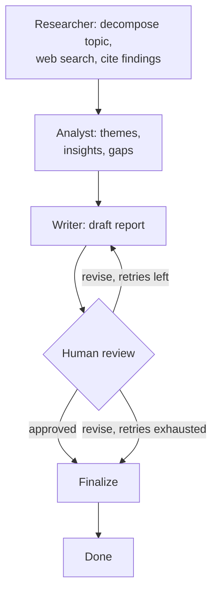

# Multi-Agent Research Report Generator

A FastAPI service where three specialized LLM agents -- researcher, analyst,
writer -- coordinate through a LangGraph state machine to turn a topic into
a cited report, with a genuine human-in-the-loop review checkpoint before
anything is finalized. Project 3 in a three-project portfolio built against
a specific AI/ML Engineer JD; this one targets the JD's agentic
orchestration, human-in-the-loop, and AI Ops/monitoring language
specifically (Project 1 covers RAG/retrieval in depth already, so this
project deliberately explores different territory: real web search instead
of local documents, multi-agent hand-offs instead of a single self-correcting
loop, and a pause-and-resume workflow instead of a single request/response).

## JD coverage

| JD requirement | Where it lives |
|---|---|
| Multi-step reasoning workflows, agent orchestration | `app/graph.py` -- 5-node LangGraph state machine with distinct agent roles and hand-offs |
| Human-in-the-loop | `app/graph.py`'s `human_review_node`, via LangGraph's `interrupt()` -- genuinely pauses and resumes across separate HTTP requests, not simulated |
| Tool integration | `app/tools.py` -- Tavily web search, with per-query error isolation |
| Feature flags for model updates | `app/config.py` / `app/providers.py` -- each agent (researcher/analyst/writer) can be pinned to a different model via `.env`, no code change |
| Interactive Web Studio UI | `app/static/index.html` & `app/main.py` -- Modern single-page UI for launching research, tracking agent progress, reviewing drafts, and submitting human feedback |
| Monitoring / system health | `app/metrics.py`, `/metrics` endpoint -- request counts, latency percentiles, error rate, revision/finalization counts |
| Model fallback / reliability | `app/providers.py` -- `max_retries`/`timeout` on every LLM call |
| CI/CD | `.github/workflows/ci.yml` -- lint + full test suite on every push |

## Architecture



- **Researcher**: decomposes the topic into up to `MAX_RESEARCH_QUERIES`
  distinct search queries (LLM call), runs them against Tavily, then
  synthesizes the raw results into cited notes -- explicitly instructed to
  flag contradictions and gaps rather than smooth them over.
- **Analyst**: turns research notes into structured analysis (key themes,
  notable insights, gaps & contradictions), grounded only in what the
  researcher actually found.
- **Writer**: drafts the report from the analysis on the first pass; on a
  revision pass, rewrites the *existing* draft against reviewer feedback
  instead of starting over.
- **Human review**: a real pause, not a UI dropdown. The graph's execution
  state is checkpointed and the process can move on to other requests while
  a report sits "awaiting review" -- a completely separate HTTP call,
  potentially hours later, resumes it exactly where it left off.
- **Revision loop**: capped at `MAX_REVISIONS` (3) -- the same bounded-retry
  philosophy as Project 1's agentic RAG loop. Past the cap, the graph
  force-finalizes with the current draft plus an explicit note, rather than
  letting a human request revisions forever.

## Setup

```bash
uv sync --frozen
cp .env.example .env
# edit .env: set GROQ_API_KEY (console.groq.com/keys) and
# TAVILY_API_KEY (app.tavily.com) -- both have free tiers, no card required
```

## Usage -- full lifecycle via curl

**1. Start a report** (this runs researcher -> analyst -> writer and pauses for review; takes 15-40s depending on search/LLM latency):
```bash
curl -X POST http://127.0.0.1:8000/research \
  -H "Content-Type: application/json" \
  -d '{"topic": "current state of small modular nuclear reactors"}'
```
Response includes a `thread_id` and the first `draft`, with `awaiting_review: true`.

**2. Check status any time** (e.g. from a different process, hours later):
```bash
curl http://127.0.0.1:8000/research/{thread_id}
```

**3a. Request a revision:**
```bash
curl -X POST http://127.0.0.1:8000/research/{thread_id}/review \
  -H "Content-Type: application/json" \
  -d '{"approved": false, "feedback": "add more detail on cost per MWh"}'
```
Returns a new `draft` with `revision_count` incremented, paused for review again.

**3b. Or approve it:**
```bash
curl -X POST http://127.0.0.1:8000/research/{thread_id}/review \
  -H "Content-Type: application/json" \
  -d '{"approved": true}'
```
Returns `status: "finalized"` and the `final_report`.

## Testing

```bash
uv run pytest tests/ -v
```
20 tests, all fully mocked (no real API calls) -- covers the full HTTP
lifecycle (start/status/revise/approve), the revision cap, auth, error
handling, and each agent's branching logic (JSON-decomposition fallback,
first-draft vs. revision-pass prompting) in isolation from the graph.

## Deploying to GCP Cloud Run

Same pattern as Project 1 -- see that project's README for the fully
walked-through first-timer version (gcloud install, project creation,
billing). Once you have a project with billing linked:

```bash
gcloud services enable run.googleapis.com cloudbuild.googleapis.com \
  artifactregistry.googleapis.com secretmanager.googleapis.com

gcloud artifacts repositories create research-repo --repository-format=docker --location=us-central1

gcloud builds submit --tag us-central1-docker.pkg.dev/YOUR_PROJECT_ID/research-repo/multi-agent-research:latest

echo -n "gsk-your-real-key" | gcloud secrets create groq-api-key --data-file=-
echo -n "tvly-your-real-key" | gcloud secrets create tavily-api-key --data-file=-
# grant the Cloud Run service account secretmanager.secretAccessor on both secrets

gcloud run deploy multi-agent-research \
  --image us-central1-docker.pkg.dev/YOUR_PROJECT_ID/research-repo/multi-agent-research:latest \
  --region us-central1 \
  --allow-unauthenticated \
  --memory 1Gi \
  --timeout 300 \
  --set-env-vars MODEL_PROVIDER=groq \
  --set-secrets GROQ_API_KEY=groq-api-key:latest,TAVILY_API_KEY=tavily-api-key:latest
```

## Known limitations (say these before you're asked)

- **`MemorySaver` is in-process and per-instance.** A paused (awaiting-review)
  thread does not survive a restart, and does not work correctly if Cloud
  Run scales to more than one instance -- each instance has its own memory,
  so a review call could land on an instance that never saw the original
  request. Fine for a single-instance demo; the documented next step is a
  persisted checkpointer (LangGraph supports Postgres/SQLite backends).
- **No timeout eviction for abandoned threads.** `REVIEW_TIMEOUT_MINUTES`
  is defined in config but not yet enforced -- a report that's never
  reviewed just sits in memory indefinitely. A real system would need a
  background job to expire/evict old paused threads.
- **`/metrics` resets on restart and doesn't aggregate across instances** --
  same limitation as Project 1's metrics, same reasoning: honest about it
  rather than presenting it as production-grade.
- **The researcher's query decomposition can silently degrade.** If the
  LLM returns unparseable JSON, it falls back to a single search using the
  raw topic instead of failing the request -- a deliberate fail-open choice
  (tested explicitly), but it means research depth can vary between runs
  without an obvious signal to the caller.

## Roadmap

1. Persisted checkpointer (Postgres/SQLite) so review state survives
   restarts and works across multiple Cloud Run instances.
2. Enforce `REVIEW_TIMEOUT_MINUTES` via a background eviction job.
3. Surface `sub_queries` and per-query search results in the API response
   (currently only the synthesized notes are kept) -- would let a reviewer
   see exactly what was searched, not just what was concluded.
4. LangSmith tracing is wired in (`@traceable` on every node, same as
   Project 1) but not yet exercised against a real LangSmith project in
   this README's examples -- worth a walkthrough once deployed.
5. A shared observability view across this project and Project 1's
   `/metrics` -- deferred since Project 2 (which the original 3-project
   plan expected to sit between them) wasn't built.

## Project structure

```
app/
  config.py       # env config, per-agent model overrides, Secret Manager fallback (with logging on failure)
  providers.py    # get_llm() factory -- Groq / Vertex AI, per-agent model override support
  tools.py          # Tavily web search wrapper, per-query error isolation
  agents.py          # researcher / analyst / writer node logic + prompts
  graph.py             # LangGraph state machine, human-in-the-loop, revision cap
  metrics.py             # lightweight in-process metrics
  main.py                   # FastAPI endpoints, auth, rate limiting, structured logging
tests/                        # 20 tests, fully mocked
.github/workflows/ci.yml         # lint + test on every push
Dockerfile
```
